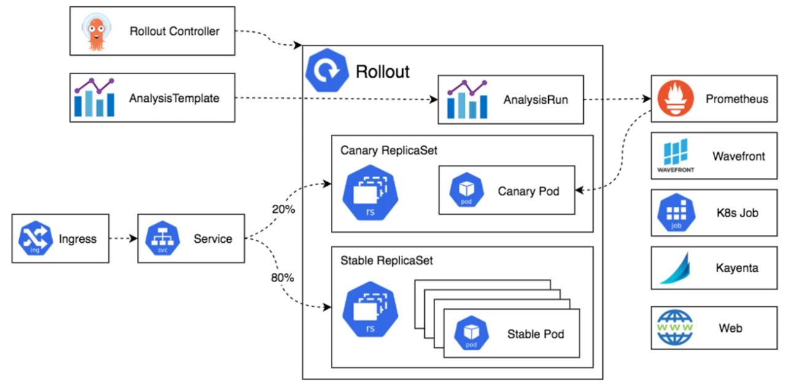

# Argo Rollouts

## Estratégias de implementação contínua

### Blue-Green Update Strategy

<b>Descrição</b>: Essa estratégia envolve manter duas versões do seu aplicativo, uma ativa (versão azul) e uma inativa (versão verde). A versão ativa é a que está atualmente em produção, enquanto a inativa está pronta para ser ativada.

<b>Como funciona</b>: Você implanta a nova versão (verde) em um ambiente paralelo ao da versão atual (azul). Uma vez que a versão verde é testada e verificada, o tráfego é redirecionado da versão azul para a verde. Isso pode ser feito quase instantaneamente, minimizando o tempo de inatividade.

<b>Vantagens</b>: Permite rollback rápido caso a nova versão tenha problemas, minimizando o impacto nos usuários.

### Canary Update Strategy

<b>Descrição</b>: A estratégia Canary envolve implantar a nova versão do aplicativo para um subconjunto de usuários antes de disponibilizá-la para todos. O nome "canário" vem dos canários usados nas minas de carvão para detectar gases perigosos.

<b>Como funciona</b>: Uma pequena porcentagem do tráfego de usuários é direcionada para a nova versão (canário) enquanto o restante continua a usar a versão antiga. Se não houver problemas, a nova versão é gradualmente disponibilizada para mais usuários até substituir completamente a versão antiga.

<b>Vantagens</b>: Permite monitorar a nova versão com um pequeno grupo de usuários, identificando e corrigindo problemas antes de um lançamento mais amplo.

### Fine-grained, Weighted Traffic Shifting

<b>Descrição</b>: Essa é uma abordagem mais detalhada e controlada para a implantação de novas versões, onde o tráfego é direcionado de forma ponderada entre as versões do aplicativo.

<b>Como funciona</b>: Semelhante ao Canary, mas com mais controle sobre a distribuição do tráfego. Você pode definir porcentagens específicas de tráfego para serem direcionadas para a nova versão, ajustando essas porcentagens conforme a nova versão é validada.

<b>Vantagens</b>: Proporciona maior controle e flexibilidade na distribuição de tráfego, permitindo ajustes precisos com base no desempenho e estabilidade da nova versão.

## 💻 Pré-requisitos

Antes de começar, verifique se você atendeu aos seguintes requisitos:

- Instalar o MINIKUBE

    https://minikube.sigs.k8s.io/docs/start/?arch=%2Fwindows%2Fx86-64%2Fstable%2F.exe+download

    https://kubernetes.io/pt-br/docs/tutorials/hello-minikube/

- Instalar o HELM

    https://helm.sh/docs/intro/install/

- Instalar o Argo Rollout

    kubectl create namespace argo-rollouts

    ubectl apply -n argo-rollouts -f https://github.com/argoproj/argo-rollouts/releases/latest/download/install.yaml

- Instalar o plugin argo/kubectl

    https://github.com/argoproj/argo-rollouts/releases

    No windows, baixar a versão kubectl-argo-rollouts-windows-amd64, renomear para kubectl-argo-rollouts.exe e adcionar no environment PATH

    kubectl argo rollouts version